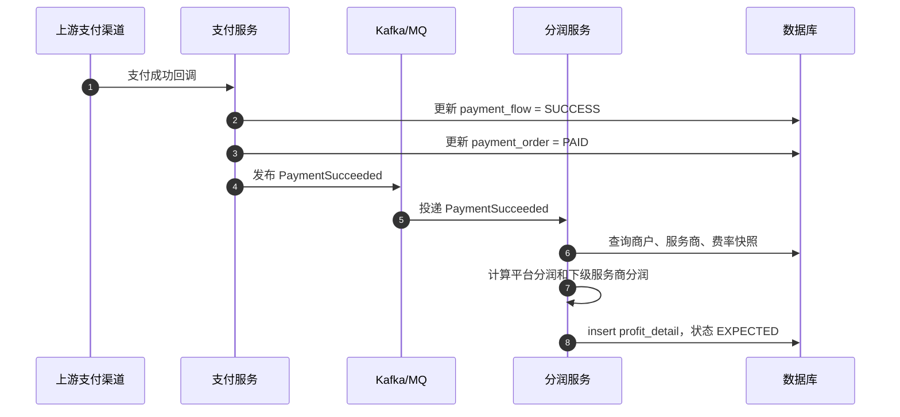
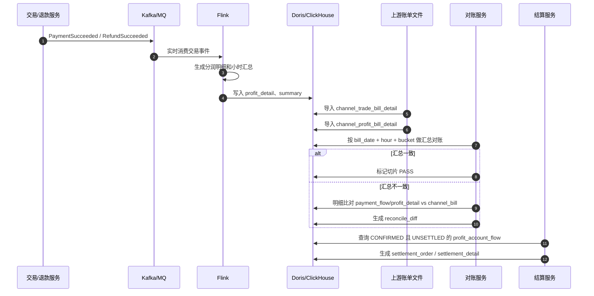
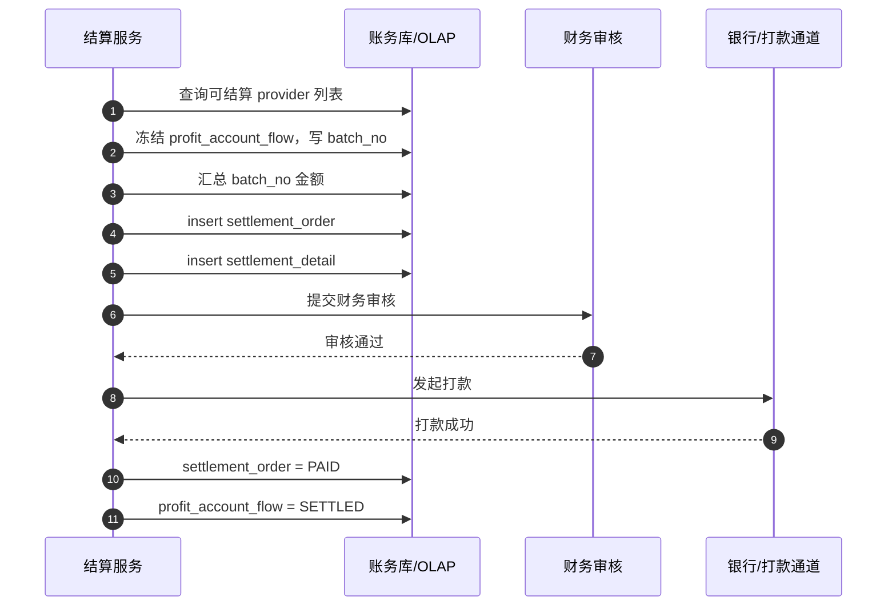
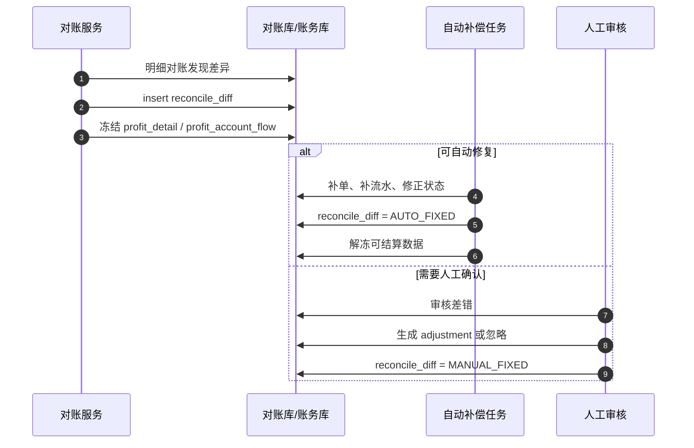

# 四方支付服务商对账结算设计详解

## 1. 业务场景

本文讨论的是服务商模式下的四方支付场景。

参与方：

```text
上游支付机构 / 三方支付渠道
你们平台：一级服务商 / 技术服务商
下级服务商：拓展商户
商户：实际收款方
用户：实际付款方
```

典型链路：

```text
下级服务商拓展商户
商户通过你们系统进件
你们把资料提交给上游支付机构
上游审核通过后回调你们
商户可以开始交易
```

资金流：

```text
用户付款给商户
上游支付机构直接清算交易本金给商户
上游支付机构把服务商分润结算给你们
你们再把下级服务商应得分润结算给下级服务商
```

所以你们系统的核心不是保管交易本金，而是：

```text
记录交易事实
计算服务商分润
核对上游账单
给下级服务商结算分润
处理退款冲正、调账、差错
```

一句话：

**你们结算的不是商户交易本金，而是服务商分润。**

---

## 2. 为什么要对账

对账不是为了做报表，而是为了防止分润、结算和资金入账出错。

对账要确认三件事：

```text
我方记录的交易事实是否正确
上游支付机构记录的交易事实是否正确
我方应收、应付、已结算金额是否正确
```

如果不对账，可能出现：

```text
上游成功，我方没记录，导致漏算分润
我方成功，上游没记录，导致多算分润
交易金额不一致，导致手续费和分润错误
退款成功但分润未冲正，导致多结算给服务商
上游分润金额和我方计算不一致
上游实际打款金额和我方应收分润不一致
下级服务商结算金额多结或少结
```

对账的最终目标：

```text
发现差错
冻结差错
修正差错
只把确认无误的数据进入结算
```

所以在服务商分润场景中，推荐原则是：

```text
先对账，后结算。
有差错，先挂起。
差错闭环后，再补结或调账。
```

---

## 3. 三本账

服务商支付系统里，至少要拆三本账。

### 3.1 交易账

交易账记录支付和退款事实。

核心表：

```text
payment_flow
refund_flow
```

回答的问题：

```text
这笔支付是否成功？
支付金额是多少？
上游交易号是什么？
是否发生退款？
退款金额是多少？
```

### 3.2 分润账

分润账记录每笔交易应该给谁分钱、分多少钱。

核心表：

```text
profit_detail
profit_account_flow
```

回答的问题：

```text
这笔交易对应哪个商户？
这个商户属于哪个下级服务商？
当时费率是多少？
上游成本是多少？
平台收益是多少？
下级服务商收益是多少？
退款后要冲回多少分润？
```

### 3.3 结算账

结算账记录某个账期实际应该给服务商结多少钱，以及是否已经打款。

核心表：

```text
settlement_order
settlement_detail
settlement_payout_flow
```

回答的问题：

```text
某个服务商某个账期应结多少钱？
由哪些分润流水组成？
是否审核？
是否打款？
打款是否成功？
失败后是否重试？
```

整体链路：

```text
交易账 -> 分润账 -> 结算账
```

---

## 4. 费率差分润示例

假设一笔交易金额为 `10000 元`。

费率配置：

```text
上游给你们的成本费率：2.1‰
你们给下级服务商的费率：2.5‰
下级服务商给商户的费率：3.0‰
```

计算：

```text
商户总手续费 = 10000 * 3.0‰ = 30 元
上游通道成本 = 10000 * 2.1‰ = 21 元
总分润空间 = 30 - 21 = 9 元

你们平台收益 = 10000 * (2.5‰ - 2.1‰) = 4 元
下级服务商收益 = 10000 * (3.0‰ - 2.5‰) = 5 元
```

如果上游把总服务商分润 `9 元` 结给你们：

```text
你们收到 9 元
你们给下级服务商结算 5 元
你们自己留下 4 元
```

注意：

```text
费率必须保存交易快照。
```

不要在结算时读取当前费率重新计算历史交易。

原因是：

```text
商户费率可能变化
下级服务商费率可能变化
上游成本费率可能变化
历史交易必须按交易发生时的费率结算
```

---

## 5. 推荐表模型

### 5.1 商户和服务商关系

```text
service_provider
- provider_id
- provider_name
- provider_level
- parent_provider_id
- status

merchant
- merchant_id
- merchant_name
- provider_id
- status

merchant_channel
- merchant_id
- channel
- channel_merchant_no
- audit_status
- audit_time

rate_config
- config_id
- merchant_id
- provider_id
- channel
- merchant_rate
- provider_rate
- channel_cost_rate
- effective_time
- expire_time
```

### 5.2 交易表

```text
payment_flow
- flow_id
- trade_no
- channel_trade_no
- merchant_id
- provider_id
- channel
- trade_amount
- status
- pay_time
- bill_date

refund_flow
- refund_flow_id
- refund_no
- trade_no
- channel_refund_no
- merchant_id
- provider_id
- channel
- refund_amount
- status
- refund_time
- bill_date
```

### 5.3 上游账单表

```text
channel_trade_bill_detail
- bill_id
- bill_batch_no
- channel
- bill_date
- channel_trade_no
- out_trade_no
- trade_type
- trade_amount
- fee_amount
- status
- trade_time

channel_profit_bill_detail
- bill_id
- bill_batch_no
- channel
- bill_date
- channel_trade_no
- out_trade_no
- profit_amount
- fee_rate
- status

channel_settle_bill_detail
- bill_id
- bill_batch_no
- channel
- settle_date
- settle_amount
- bank_account
- status
```

### 5.4 分润表

```text
profit_detail
- profit_id
- trade_no
- channel_trade_no
- merchant_id
- provider_id
- channel
- trade_amount
- merchant_rate
- provider_rate
- channel_cost_rate
- provider_profit_amount
- platform_profit_amount
- channel_cost_amount
- profit_type: PAYMENT_PROFIT / REFUND_REVERSE
- bill_date
- settle_date
- status: EXPECTED / CONFIRMED / DISPUTED / SETTLED / REVERSED
```

```text
profit_account_flow
- flow_id
- provider_id
- biz_id
- biz_type: PAYMENT_PROFIT / REFUND_REVERSE / ADJUSTMENT
- amount
- direction: IN / OUT
- bill_date
- settle_date
- settle_status: UNSETTLED / SETTLING / SETTLED
- batch_no
- created_at
```

### 5.5 结算表

```text
settlement_order
- settlement_id
- provider_id
- settle_date
- batch_no
- total_profit_amount
- refund_reverse_amount
- adjust_amount
- risk_hold_amount
- payable_amount
- status: INIT / CALCULATED / AUDITING / PAYING / PAID / FAILED / CANCELED
- created_at
- paid_at
```

```text
settlement_detail
- detail_id
- settlement_id
- provider_id
- source_flow_id
- amount
- detail_type
- bill_date
- settle_date
```

```text
settlement_payout_flow
- payout_flow_id
- settlement_id
- provider_id
- amount
- bank_account
- status: PROCESSING / SUCCESS / FAILED
- channel_response_no
- created_at
- success_at
```

### 5.6 差错和调账表

```text
reconcile_diff
- diff_id
- diff_type
- channel
- bill_date
- trade_no
- channel_trade_no
- merchant_id
- provider_id
- local_amount
- channel_amount
- local_profit_amount
- channel_profit_amount
- status: NEW / AUTO_PROCESSING / AUTO_FIXED / MANUAL_REVIEW / MANUAL_FIXED / IGNORED
- handle_result
- created_at
- updated_at
```

```text
settlement_adjustment
- adjust_id
- provider_id
- amount
- direction
- reason
- audit_status
- operator
- created_at
```

---

## 6. 交易成功时生成分润明细

不要等结算任务每天全量扫 `payment_flow` 现场计算分润。

更推荐：

```text
支付成功时就生成 profit_detail
退款成功时就生成反向 profit_detail
```

支付成功事件：

```text
PaymentSucceeded
  -> payment_flow = SUCCESS
  -> 根据费率快照计算分润
  -> insert profit_detail，状态 EXPECTED
```

退款成功事件：

```text
RefundSucceeded
  -> refund_flow = SUCCESS
  -> 按退款金额计算冲正分润
  -> insert profit_detail，类型 REFUND_REVERSE
```

这样做的好处：

```text
分润计算前置，结算时不需要重算历史交易
费率快照固化，避免后续费率变化影响历史
每笔交易的分润可追溯
退款冲正有明细
对账和结算可以基于分润明细，而不是原始交易流水
```

时序图：



---

## 7. 对账分几层

你们这种服务商模式，不能只做交易对账。

至少要做三层。

### 7.1 交易对账

```text
我方 payment_flow / refund_flow
vs
上游 channel_trade_bill_detail
```

核对：

```text
交易号是否一致
金额是否一致
状态是否一致
支付时间是否在同一账期
退款是否一致
```

差错：

```text
上游成功，我方无记录
我方成功，上游无记录
金额不一致
状态不一致
重复交易
退款缺失
```

### 7.2 分润对账

```text
我方 profit_detail
vs
上游 channel_profit_bill_detail
```

核对：

```text
上游结给你们的服务商分润是否正确
交易对应关系是否正确
费率是否一致
分润金额是否一致
退款冲正是否一致
```

差错：

```text
我方应有分润，上游无分润
上游有分润，我方无分润
我方分润金额和上游不一致
退款后上游已冲正，我方未冲正
我方已冲正，上游未冲正
```

### 7.3 结算入账对账

```text
我方应收上游分润
vs
上游结算单 / 银行入账
```

核对：

```text
上游账期应结金额
实际打款金额
扣款、调账、风险扣留
到账账户
到账时间
```

只有上游分润确认后，才建议进入给下级服务商结算的可结算池。

---

## 8. 千万级数据怎么快速对账

日千万级交易，不要用一个任务全量扫大表。

核心思路：

```text
账期按天
计算按小时或 15 分钟切片
并行按渠道、服务商、商户、hash bucket 拆分
先汇总对账，再明细对账
差错单独处理
```

### 8.1 账期和计算切片分开

业务账期通常还是按天：

```text
bill_date = 2026-08-17
settle_date = 2026-08-18
```

但是计算时不要一次处理全天所有数据。

可以切成：

```text
day -> hour -> bucket
```

例如一天 1000 万笔：

```text
平均每小时约 41.6 万笔
每小时再按 64 个 bucket 切分
每个 bucket 大约 6500 笔
```

这样单个任务处理的数据量可控。

注意：

```text
小时不是最终账期，只是计算分片。
最终对账闭环和结算仍然按日账期完成。
```

### 8.2 hash bucket

明细对账时，可以按交易号分桶：

```text
bucket = hash(channel_trade_no) % 128
```

每个 bucket 独立处理。

优点：

```text
可以并行
内存可控
失败只重跑单个 bucket
定位差异更快
避免单个大任务拖垮数据库
```

### 8.3 先汇总后明细

不要一开始就逐笔比对。

先做汇总对账：

```text
channel + bill_date + hour + trade_type + bucket
count
sum_trade_amount
sum_fee_amount
sum_profit_amount
```

如果汇总一致：

```text
该切片可以快速通过
```

如果汇总不一致：

```text
再进入明细比对
```

两级对账：

```text
一级：汇总对账
二级：明细差异定位
```

### 8.4 增量和 checkpoint

每个任务必须记录处理水位：

```text
bill_batch_no
bill_date
hour
bucket
last_id
status
```

失败后可以从指定切片重跑。

不要失败后全账期重跑。

---

## 9. 推荐中间件和数据架构

大数据量对账结算，调度器只是触发器，真正决定速度的是数据链路。

推荐组合：

| 环节 | 推荐技术 | 作用 |
| --- | --- | --- |
| 消息流 | Kafka / RocketMQ | 承接支付成功、退款成功、分润事件 |
| 实时计算 | Flink | 实时聚合、去重、准实时对账、checkpoint |
| 数据同步 | Canal / Debezium / SeaTunnel / DataX | 同步业务库、账单文件、数仓数据 |
| OLAP | Doris / ClickHouse / StarRocks | 大规模明细查询、汇总对账、报表 |
| 离线计算 | Spark / Hive | 历史回补、大批量重算、离线核对 |
| 文件存储 | OSS / S3 / HDFS | 保存上游原始账单文件 |
| 调度 | Airflow / DolphinScheduler / K8s CronJob / Hera | 触发账单下载、解析、对账、结算 |

推荐架构：

```text
业务交易库
  -> binlog / MQ
  -> Kafka
  -> Flink
  -> Doris / ClickHouse

上游账单文件
  -> OSS / HDFS
  -> 批量解析
  -> channel_bill_detail
  -> Doris / ClickHouse

对账服务
  -> 先汇总
  -> 再明细
  -> 生成 reconcile_diff

结算服务
  -> 汇总 confirmed + unsettled 的 profit_account_flow
  -> 生成 settlement_order
```

整体时序图：



---

## 10. 上游账单导入流程

上游账单通常是 T+1 文件，也可能按小时提供。

推荐流程：

```text
1. 下载账单文件
2. 原始文件保存到 OSS / S3 / HDFS
3. 创建 bill_batch
4. 批量解析账单文件
5. 批量写入 channel_bill_detail
6. 生成 channel_bill_summary
7. 进入对账流程
```

账单批次表：

```text
bill_batch
- batch_no
- channel
- bill_date
- bill_type: TRADE / PROFIT / SETTLE
- file_path
- status: DOWNLOADED / PARSING / PARSED / RECONCILING / DONE / FAILED
- total_count
- total_amount
- created_at
```

入库不要逐条 insert。

推荐：

```text
批量 insert
LOAD DATA
Stream Load
Broker Load
```

每批可以按：

```text
1000
5000
10000
```

条写入，具体取决于数据库和网络情况。

---

## 11. 明细对账怎么做

明细对账一般不是业务服务逐条 RPC 查。

推荐在 OLAP 或批处理层完成。

匹配键：

```text
channel
channel_trade_no
out_trade_no
trade_type
amount
status
bill_date
```

示例逻辑：

```sql
select
    coalesce(l.channel_trade_no, c.channel_trade_no) as channel_trade_no,
    l.trade_amount as local_amount,
    c.trade_amount as channel_amount,
    l.status as local_status,
    c.status as channel_status
from local_trade_detail l
full outer join channel_trade_bill_detail c
  on l.channel = c.channel
 and l.channel_trade_no = c.channel_trade_no
where l.bill_date = #{billDate}
  and l.hour_bucket = #{hourBucket}
  and l.hash_bucket = #{hashBucket};
```

然后识别：

```text
l 有 c 无：我方有，上游无
l 无 c 有：上游有，我方无
金额不同：金额差异
状态不同：状态差异
手续费不同：手续费差异
```

如果数据库不支持高效 `full outer join`，可以用：

```text
left join 找我方多
right/anti join 找上游多
inner join 找金额状态差异
```

---

## 12. 分润对账怎么做

分润对账的对象是：

```text
profit_detail
vs
channel_profit_bill_detail
```

核对字段：

```text
channel_trade_no
trade_amount
profit_amount
rate
profit_type
bill_date
```

我方计算的分润和上游给出的分润可能不一致，原因包括：

```text
费率快照错误
上游费率配置变更未同步
上游有特殊优惠或封顶
退款手续费规则不同
交易账期归属不同
上游账单延迟
```

对账结果：

```text
一致：profit_detail -> CONFIRMED
不一致：profit_detail -> DISPUTED，生成 reconcile_diff
上游无记录：挂起，不进入结算
我方无记录：补单或人工审核
```

---

## 13. 结算单怎么生成

结算单不是直接扫原始 `payment_flow` 现场计算。

更推荐基于：

```text
已确认
未结算
未冻结
无差错
达到结算日期
属于某个服务商
```

的 `profit_account_flow` 汇总生成。

### 13.1 结算前冻结数据

生成结算单前，先把待结算流水冻结到一个批次：

```sql
update profit_account_flow
set settle_status = 'SETTLING',
    batch_no = #{batchNo}
where provider_id = #{providerId}
  and settle_date <= #{settleDate}
  and settle_status = 'UNSETTLED'
  and status = 'CONFIRMED'
  and frozen = 0;
```

这样可以避免结算过程中数据还在变化。

### 13.2 汇总生成结算单

然后按批次汇总：

```sql
select
    provider_id,
    sum(case when direction = 'IN' then amount else 0 end) as profit_amount,
    sum(case when direction = 'OUT' then amount else 0 end) as reverse_amount,
    sum(amount) as payable_amount
from profit_account_flow
where batch_no = #{batchNo}
group by provider_id;
```

生成：

```text
settlement_order
settlement_detail
```

### 13.3 结算单状态

```text
INIT
CALCULATED
AUDITING
PAYING
PAID
FAILED
CANCELED
```

打款成功后：

```text
settlement_order -> PAID
profit_account_flow -> SETTLED
```

打款失败：

```text
settlement_order -> FAILED
profit_account_flow 可以退回 UNSETTLED 或保留 SETTLING 等待重试
```

### 13.4 结算时序图



---

## 14. 退款和跨账期冲正

退款一定会影响分润。

原交易产生：

```text
下级服务商分润 +5
平台收益 +4
```

全额退款后，应该产生：

```text
下级服务商分润 -5
平台收益 -4
```

如果退款发生在结算前：

```text
本期直接抵扣
```

如果退款发生在结算后：

```text
生成负向 profit_account_flow
在下期结算冲抵
```

如果下期应结金额不够扣：

```text
形成负余额
风险保证金抵扣
人工追缴
挂账到后续账期
```

所以必须支持：

```text
反向分润明细
跨账期冲正
负结算
调账单
```

---

## 15. 差错单闭环

对账发现差异后，不应该只输出报表。

必须生成差错单：

```text
reconcile_diff
```

差错处理流程：

```text
发现差错
  -> 生成差错单
  -> 冻结相关 profit_detail / profit_account_flow
  -> 自动补偿或人工审核
  -> 处理完成
  -> 解冻或生成调账单
  -> 进入后续结算
```

时序图：



---

## 16. 任务调度器的位置

Hera、Airflow、DolphinScheduler、XXL-JOB、K8s CronJob 这类工具，本质上解决的是：

```text
什么时候跑
失败怎么重试
依赖关系怎么编排
```

它们不直接解决：

```text
大表怎么少扫
join 怎么变快
如何避免全量重算
如何快速定位差异
如何保证结算幂等
```

所以优化方向不是单纯换调度器，而是：

```text
交易时预计算
按账期分区
按 hash bucket 分片
先汇总后明细
用 OLAP 承接大查询
用 checkpoint 支持失败重跑
用差错单做闭环
```

调度器只负责触发：

```text
账单下载
账单解析
汇总对账
明细对账
差错处理
结算生成
打款确认
```

---

## 17. 面试回答模板

可以这样回答：

```text
我们这个模式不是平台保管交易本金，而是上游直接清算给商户，平台主要结算服务商分润。
所以我会把账拆成交易账、分润账、结算账。
交易成功时实时生成分润明细，保存商户费率、服务商费率、上游成本费率这些快照。
T+1 导入上游交易账单、分润账单和结算账单，分别做交易对账、分润对账和结算入账对账。
只有对账确认、无差错、未冻结、未结算的分润账户流水，才会进入结算单。
结算单不是扫 payment_flow 现场算，而是汇总 confirmed + unsettled 的 profit_account_flow。
```

数据量大时可以继续说：

```text
千万级交易不会一个任务全量扫表。
业务账期按天，但计算按小时或 15 分钟切片，再按 channel、provider_id、hash bucket 并行。
对账先做 count、sum_amount、sum_fee、sum_profit 的汇总对账，汇总不一致再做明细下钻。
数据存储上，交易库只承载在线交易，对账统计进入 Doris/ClickHouse/StarRocks 这类 OLAP，或者 Spark/Flink 做批流计算。
每个任务都有 batch_no、hour、bucket、checkpoint，失败只重跑对应切片。
差异生成 reconcile_diff，冻结相关分润流水，自动补偿或人工闭环。
```

最后收口：

```text
调度器只解决什么时候跑，不解决怎么算得快。
真正的核心是交易时预计算、对账时确认、结算时汇总，以及分区、分片、增量、OLAP 和差错闭环。
```

---

## 18. 总结

服务商分润场景的核心链路：

```text
支付成功 / 退款成功
  -> 生成分润明细 profit_detail
  -> 导入上游交易账单、分润账单、结算账单
  -> 交易对账、分润对账、结算入账对账
  -> 对账确认后生成 profit_account_flow
  -> 汇总未结算分润流水生成 settlement_order
  -> 审核和打款
  -> 差错和退款通过冲正、调账、补偿闭环
```

大数据量优化：

```text
按账期分区
按小时或 15 分钟切片
按 provider/channel/hash bucket 并行
先汇总后明细
使用 checkpoint
批量导入账单
交易时预计算分润
结算时汇总账户流水
使用 Doris / ClickHouse / StarRocks / Spark / Flink 承接大规模计算
```

最终一句话：

**对账的目的不是统计，而是确认交易、分润和结算事实是否一致；结算单的来源不是原始交易流水现场计算，而是已对账确认的分润账户流水汇总。**

---

## 19. 参考技术

以下技术常用于大规模对账、结算和分析链路：

```text
Kafka / RocketMQ：交易事件、分润事件传输
Flink：实时聚合、准实时对账、checkpoint
Spark / Hive：离线批处理和历史回补
Doris / ClickHouse / StarRocks：OLAP 明细查询和汇总统计
SeaTunnel / DataX / Canal / Debezium：数据同步和 CDC
OSS / S3 / HDFS：上游原始账单文件存储
Airflow / DolphinScheduler / Hera / K8s CronJob：任务编排和调度
```
