# 电商下单、支付、退款流程详解

## 1. 涉及的核心表

本文围绕以下几张表说明电商支付链路：

```text
order              业务订单表
order_item         订单商品明细表
payment_order      支付订单表
payment_flow       支付流水表
refund_order       退款订单表
refund_item        退款商品明细表
refund_flow        退款流水表
```

核心关系：

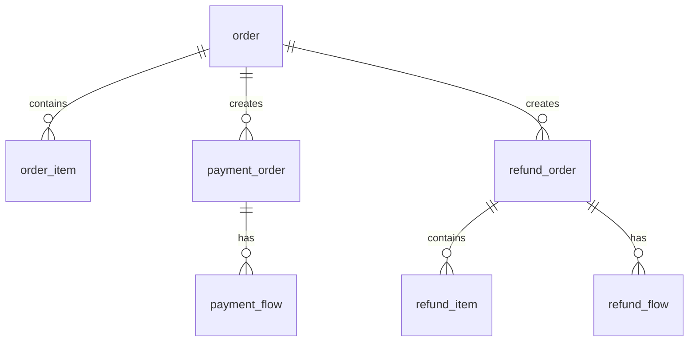

可以先这样理解：

| 表 | 核心职责 |
| --- | --- |
| order | 记录一笔业务订单的主状态 |
| order_item | 记录订单里的商品快照和商品级状态 |
| payment_order | 记录这笔订单的收款任务 |
| payment_flow | 记录每一次支付渠道请求 |
| refund_order | 记录一次退款业务申请 |
| refund_item | 记录这次退款涉及哪些订单商品 |
| refund_flow | 记录每一次退款渠道请求 |

---

## 2. 下单到支付完成总流程

整体流程：

```text
提交订单
  -> 校验商品、价格、优惠、库存
  -> 预占库存、锁定优惠券/活动名额
  -> 创建业务订单、订单商品明细、支付订单
  -> 发起支付
  -> 创建支付流水
  -> 调用第三方支付
  -> 接收支付成功回调
  -> 更新支付流水、支付订单、业务订单、订单商品明细
  -> 确认库存消耗、核销优惠券/活动名额
```

### 2.1 下单阶段

用户点击“提交订单”后，系统先进行业务校验：

```text
校验商品是否存在
校验 SKU 是否可售
校验库存是否足够
校验价格是否变化
校验优惠券是否可用
计算商品金额、优惠金额、运费、应付金额
```

校验通过后，通常先预占库存、锁定优惠券或活动名额，然后再创建待支付订单。

如果库存预占失败，不能继续创建待支付订单。否则可能出现用户已经拿到订单甚至完成支付，但系统发现库存不足的情况。

库存预占常见做法：

```text
available_stock = available_stock - quantity
locked_stock = locked_stock + quantity
```

这里的“扣库存”更准确地说是“预占库存”，不是最终销售出库。最终库存消耗通常在支付成功后确认。

如果是单体应用或同一个数据库，推荐把库存预占、优惠锁定、订单创建放在同一个本地事务里：

| 表 | 操作 | 说明 |
| --- | --- | --- |
| 库存表/库存服务 | update | 减少可售库存，增加锁定库存 |
| 优惠券/活动名额 | update | 锁定优惠券或活动名额 |
| order | insert | 创建业务订单，状态为 WAIT_PAY |
| order_item | insert | 创建订单商品明细，保存商品快照 |
| payment_order | insert | 创建支付订单，状态为 WAIT_PAY |
| payment_flow | 可选 insert | 如果下单时已经选择支付渠道，可以同时创建 INIT/PAYING 流水 |

示例数据：

```text
order
- order_id = O1001
- user_id = U001
- goods_amount = 120
- discount_amount = 20
- freight_amount = 0
- pay_amount = 100
- paid_amount = 0
- refunded_amount = 0
- order_status = WAIT_PAY

order_item
- item_id = I001
- order_id = O1001
- sku_id = SKU001
- quantity = 1
- sale_price = 60
- pay_amount = 50
- item_status = WAIT_PAY

order_item
- item_id = I002
- order_id = O1001
- sku_id = SKU002
- quantity = 1
- sale_price = 60
- pay_amount = 50
- item_status = WAIT_PAY

payment_order
- pay_order_id = P1001
- biz_order_id = O1001
- pay_amount = 100
- paid_amount = 0
- pay_status = WAIT_PAY
- expire_time = 30 分钟后
```

下单阶段的时序图：

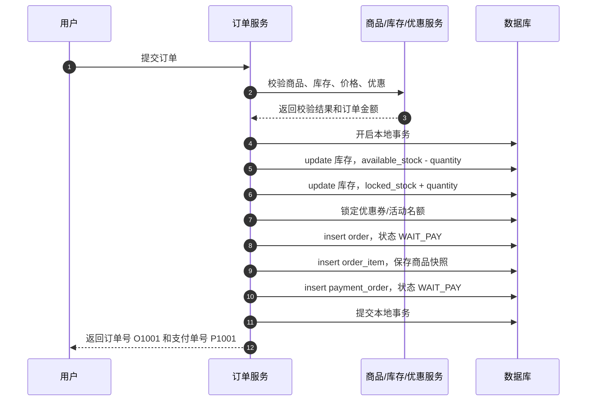

注意：

```text
下单阶段必须先完成库存预占，才能返回待支付订单。
业务顺序上是先预占库存，再创建待支付订单。
实现上可以放在同一个本地事务中一起提交。
支付流水可以不在下单阶段生成。
如果用户提交订单时已经选择了支付渠道，也可以和支付订单一起生成支付流水。
```

---

### 2.2 发起支付阶段

用户选择支付渠道后，例如支付宝或微信，系统发起支付。

这一阶段通常会创建一条支付流水。

| 表 | 操作 | 说明 |
| --- | --- | --- |
| order | select | 校验订单是否 WAIT_PAY |
| payment_order | select/update | 校验支付单是否可支付，更新为 PAYING |
| payment_flow | insert | 创建支付流水，状态 INIT 或 PAYING |

示例数据：

```text
payment_flow
- flow_id = F1001
- pay_order_id = P1001
- biz_order_id = O1001
- user_id = U001
- amount = 100
- pay_channel = ALIPAY
- flow_status = PAYING
- request_no = REQ1001
```

发起支付阶段的时序图：

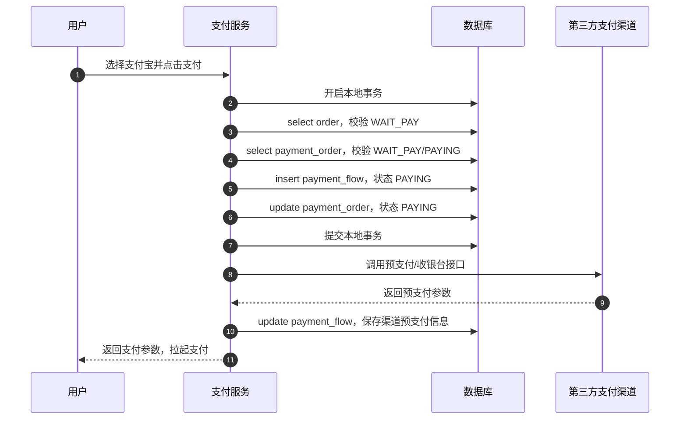

关键点：

```text
数据库事务只包本地数据落库。
调用微信、支付宝、银行卡等第三方接口，不要放在数据库事务里。
```

不推荐：

```text
开启数据库事务
  -> 插入订单
  -> 插入支付单
  -> 插入支付流水
  -> 调用第三方支付
  -> 提交事务
```

推荐：

```text
开启数据库事务
  -> 插入订单、支付单、支付流水
提交事务
调用第三方支付
根据结果更新流水
```

---

### 2.3 支付成功回调阶段

用户完成支付后，第三方支付平台通过异步回调通知系统。

支付成功不能只相信前端跳转结果，最终应以：

```text
第三方支付回调
或主动查单结果
```

为准。

支付成功回调需要处理：

| 表 | 操作 | 说明 |
| --- | --- | --- |
| payment_flow | update | 更新流水为 SUCCESS，保存第三方交易号 |
| payment_order | update | 更新支付单为 PAID |
| order | update | 更新订单为 PAID |
| order_item | update | 更新订单商品为 PAID |
| 库存表/库存服务 | update | 锁定库存转为已售库存 |
| 优惠券/活动名额 | update | 锁定状态转为已核销/已使用 |

示例更新：

```text
payment_flow
- flow_status = SUCCESS
- channel_trade_no = ALI202608160001
- notify_time = 当前时间
- success_at = 当前时间

payment_order
- pay_status = PAID
- paid_amount = 100
- success_flow_id = F1001
- pay_channel = ALIPAY
- paid_at = 当前时间

order
- order_status = PAID
- paid_amount = 100
- paid_at = 当前时间

order_item
- item_status = PAID

inventory_stock
- locked_stock = locked_stock - quantity
- sold_stock = sold_stock + quantity
```

支付成功回调时序图：

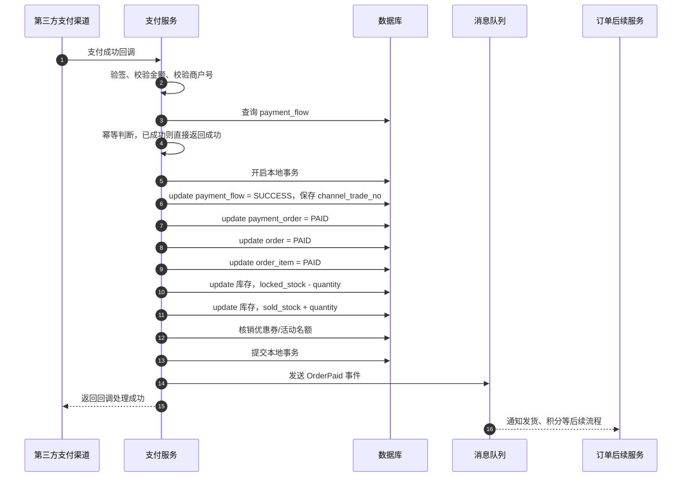

幂等处理很重要。

第三方支付回调可能重复发送，所以支付成功处理必须保证：

```text
同一条 payment_flow 只能从 PAYING 更新为 SUCCESS 一次。
同一笔 payment_order 只能被支付成功一次。
同一笔 order 只能被从 WAIT_PAY 推进到 PAID 一次。
```

常见做法：

```sql
update payment_flow
set flow_status = 'SUCCESS'
where flow_id = ?
  and flow_status in ('INIT', 'PAYING');
```

如果更新行数为 0，说明这笔流水可能已经处理过，需要走幂等返回。

---

## 3. 支付失败和订单超时

### 3.1 支付失败

如果第三方支付返回失败，通常只更新支付流水。

| 表 | 操作 | 说明 |
| --- | --- | --- |
| payment_flow | update | 更新为 FAIL，保存失败原因 |
| payment_order | update 可选 | 可以保持 WAIT_PAY，也可以记录最近失败原因 |
| order | 通常不更新为取消 | 用户可能换渠道继续支付 |

示例：

```text
payment_flow
- flow_status = FAIL
- fail_reason = 用户取消支付 / 支付失败 / 渠道错误
```

用户可以重新发起支付，此时新增一条支付流水：

```text
F1001，支付宝，失败
F1002，微信，成功
```

支付失败重试时序图：

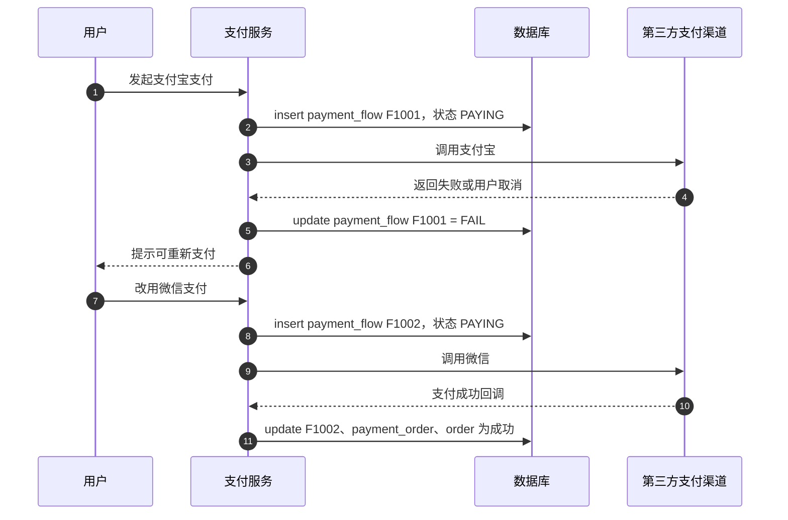

### 3.2 订单超时未支付

订单超过支付有效期后，需要关闭订单。

| 表 | 操作 | 说明 |
| --- | --- | --- |
| order | update | 更新为 CANCELED |
| order_item | update | 更新为 CANCELED |
| payment_order | update | 更新为 CLOSED |
| payment_flow | update 可选 | 将未完成流水更新为 CLOSED |
| 库存/优惠券 | update | 释放预占库存、释放优惠券 |

库存释放常见做法：

```text
available_stock = available_stock + quantity
locked_stock = locked_stock - quantity
```

超时关闭时序图：

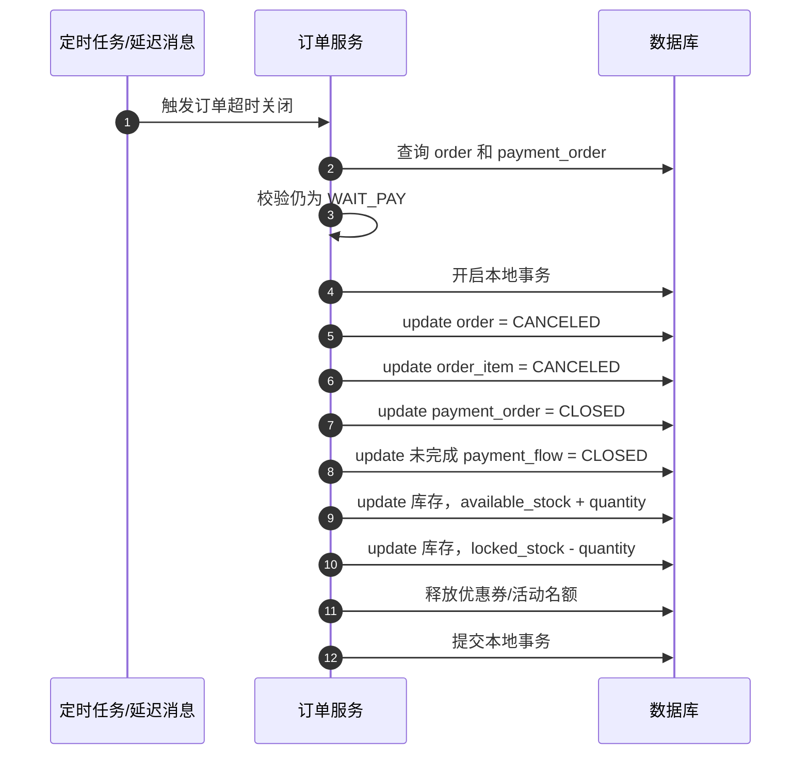

如果关闭订单和释放库存分属不同服务，实际项目中更常用消息或分布式事务方案来保证最终一致。

---

## 4. 退款流程

退款链路和支付链路类似，也分为：

```text
退款申请
退款审核
发起退款
退款成功回调
退款失败重试
```

假设订单 `O1001` 已支付 100 元，用户申请退款 30 元。

### 4.1 用户申请退款

申请退款时，先做业务校验：

```text
订单是否已支付
订单是否允许退款
退款金额是否小于等于可退金额
退款商品数量是否小于等于可退数量
是否存在互斥的处理中售后单
```

然后开启本地事务，写入退款单和退款商品明细。

| 表 | 操作 | 说明 |
| --- | --- | --- |
| order | select/update 可选 | 校验订单，必要时更新为 REFUNDING |
| order_item | select/update 可选 | 校验商品可退数量，必要时更新为 REFUNDING |
| refund_order | insert | 创建退款单 |
| refund_item | insert | 创建退款商品明细 |

示例：

```text
refund_order
- refund_order_id = R1001
- biz_order_id = O1001
- pay_order_id = P1001
- user_id = U001
- refund_amount = 30
- refunded_amount = 0
- refund_status = WAIT_AUDIT 或 WAIT_REFUND
- refund_type = ONLY_REFUND
- refund_reason = 用户申请退款

refund_item
- refund_item_id = RI001
- refund_order_id = R1001
- order_item_id = I001
- sku_id = SKU001
- refund_quantity = 1
- refund_amount = 30
```

申请退款时序图：

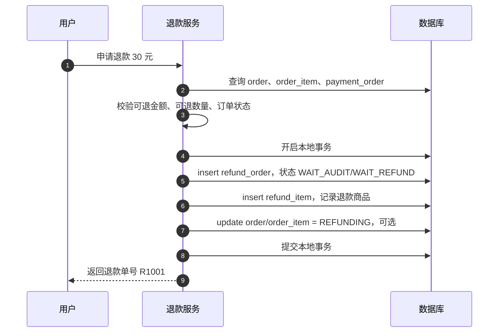

---

### 4.2 退款审核

有些业务需要商家或平台审核退款。

审核通过：

| 表 | 操作 | 说明 |
| --- | --- | --- |
| refund_order | update | 更新为 WAIT_REFUND |

审核拒绝：

| 表 | 操作 | 说明 |
| --- | --- | --- |
| refund_order | update | 更新为 REJECTED |
| order_item | update 可选 | 恢复原商品状态 |
| order | update 可选 | 根据订单其他售后状态重新计算 |

审核通过时序图：

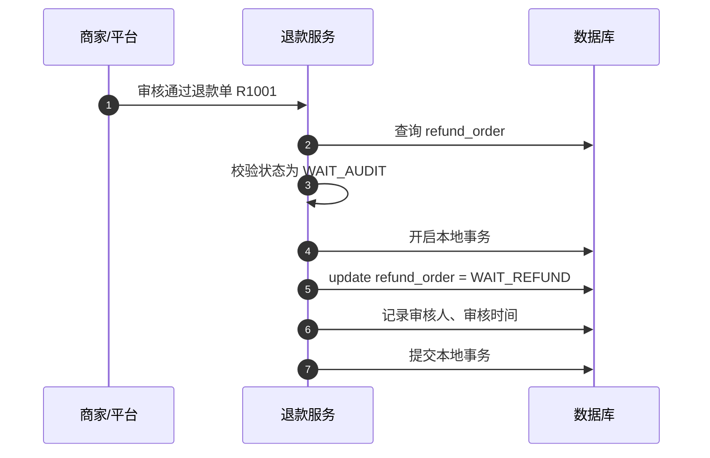

如果业务不需要审核，可以在申请退款后直接进入发起退款阶段。

---

### 4.3 发起退款

发起退款时，需要找到原成功支付流水。

原因是第三方退款通常需要：

```text
原支付交易号 channel_trade_no
退款金额 refund_amount
退款请求号 request_no
```

处理表：

| 表 | 操作 | 说明 |
| --- | --- | --- |
| refund_order | select/update | 校验并更新为 REFUNDING |
| payment_order | select | 查询原支付单 |
| payment_flow | select | 查询原成功支付流水 |
| refund_flow | insert | 创建退款流水，状态 REFUNDING |

示例：

```text
refund_flow
- refund_flow_id = RF1001
- refund_order_id = R1001
- biz_order_id = O1001
- pay_order_id = P1001
- payment_flow_id = F1001
- refund_amount = 30
- pay_channel = ALIPAY
- flow_status = REFUNDING
- request_no = REFUND_REQ1001
- channel_trade_no = ALI202608160001
```

发起退款时序图：

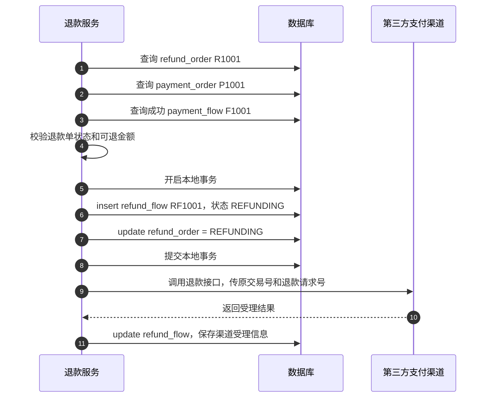

同样需要注意：

```text
调用第三方退款接口不要放在数据库事务里。
```

---

### 4.4 退款成功回调

第三方支付平台通知退款成功后，系统需要回写退款流水、退款单、订单和订单商品。

| 表 | 操作 | 说明 |
| --- | --- | --- |
| refund_flow | update | 更新退款流水为 SUCCESS |
| refund_order | update | 更新退款单为 SUCCESS |
| order | update | 增加已退款金额，重算订单状态 |
| order_item | update | 增加商品已退款金额，重算商品状态 |
| payment_order | update 可选 | 增加支付单已退款金额 |

示例：

```text
refund_flow
- flow_status = SUCCESS
- channel_refund_no = ALI_REFUND_1001
- notify_time = 当前时间
- success_at = 当前时间

refund_order
- refund_status = SUCCESS
- refunded_amount = 30
- success_time = 当前时间

order
- refunded_amount = 原 refunded_amount + 30
- order_status = PART_REFUNDED 或 REFUNDED

order_item
- refund_amount = 原 refund_amount + 30
- item_status = PART_REFUNDED 或 REFUNDED

payment_order
- refunded_amount = 原 refunded_amount + 30
```

退款成功回调时序图：

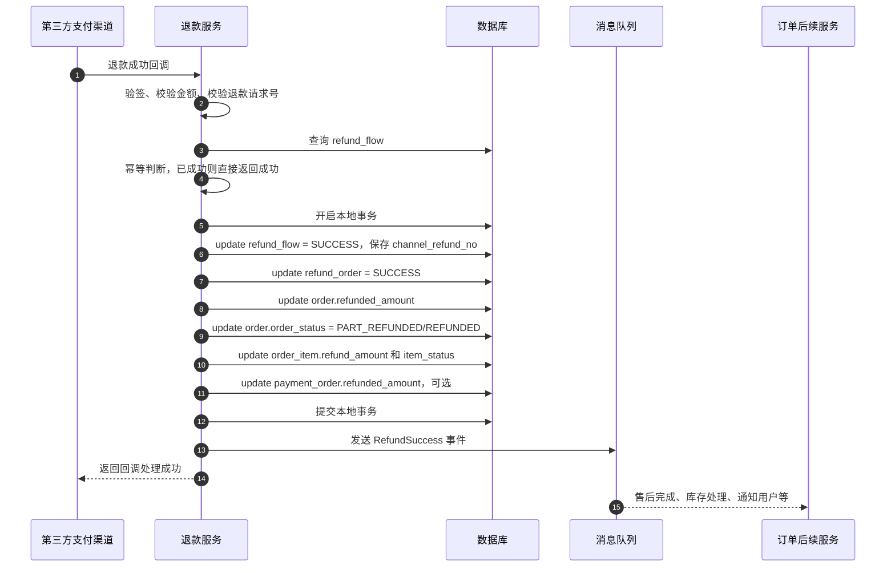

订单状态判断：

```text
如果 order.refunded_amount < order.paid_amount：
    order_status = PART_REFUNDED

如果 order.refunded_amount = order.paid_amount：
    order_status = REFUNDED
```

退款金额必须保证：

```text
本次退款金额 + 已成功退款金额 <= 已成功支付金额
```

---

### 4.5 退款失败和重试

如果第三方退款失败：

| 表 | 操作 | 说明 |
| --- | --- | --- |
| refund_flow | update | 更新为 FAIL，保存失败原因 |
| refund_order | update | 更新为 REFUND_FAIL 或可重试状态 |
| order/order_item | update 可选 | 根据业务决定是否恢复状态 |

如果允许重试，不要复用失败流水，建议新增一条退款流水。

示例：

```text
refund_order R1001
- refund_amount = 30
- refund_status = SUCCESS

refund_flow RF1001
- refund_amount = 30
- flow_status = FAIL

refund_flow RF1002
- refund_amount = 30
- flow_status = SUCCESS
```

退款失败重试时序图：

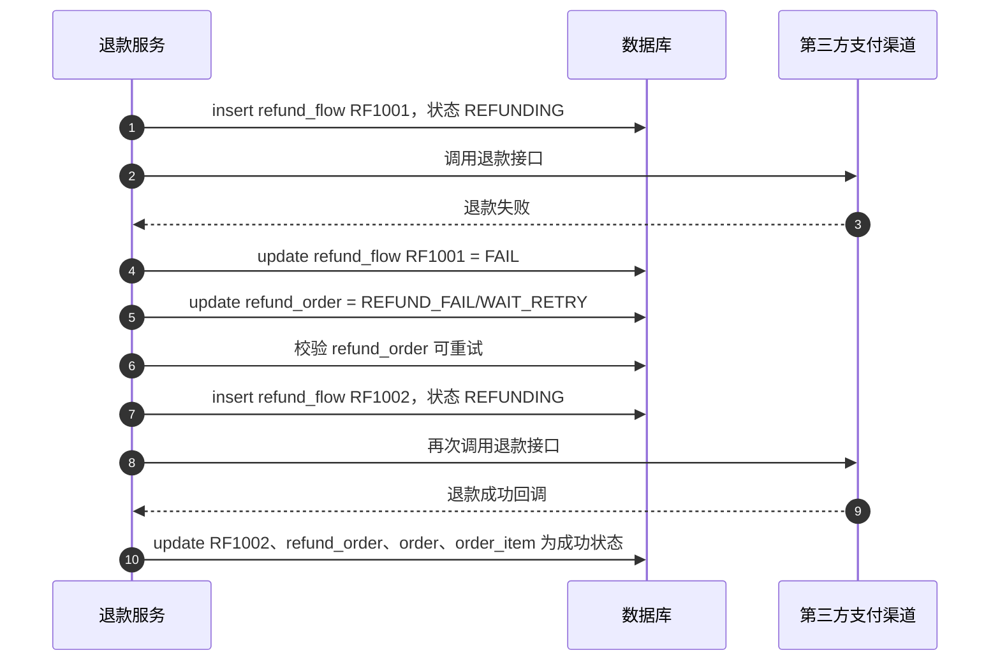

---

## 5. 每个阶段处理哪些表

### 5.1 下单支付链路

| 阶段 | order | order_item | payment_order | payment_flow | 库存/优惠 |
| --- | --- | --- | --- | --- | --- |
| 提交订单 | insert WAIT_PAY | insert WAIT_PAY | insert WAIT_PAY | 可选 insert INIT | 预占库存、锁定优惠 |
| 发起支付 | select | - | select/update PAYING | insert PAYING | - |
| 支付受理 | - | - | - | update 渠道预支付信息 | - |
| 支付成功回调 | update PAID | update PAID | update PAID | update SUCCESS | 确认库存消耗、核销优惠 |
| 支付失败 | - | - | 可选 update | update FAIL | 不释放，订单仍可继续支付 |
| 订单超时关闭 | update CANCELED | update CANCELED | update CLOSED | update CLOSED 可选 | 释放预占库存、释放优惠 |

### 5.2 退款链路

| 阶段 | refund_order | refund_item | refund_flow | order | order_item | payment_order | payment_flow |
| --- | --- | --- | --- | --- | --- | --- | --- |
| 申请退款 | insert | insert | - | select/update REFUNDING 可选 | select/update REFUNDING 可选 | select | - |
| 审核通过 | update WAIT_REFUND | - | - | - | - | - | - |
| 发起退款 | update REFUNDING | - | insert REFUNDING | select | select | select | select 原成功支付流水 |
| 退款成功回调 | update SUCCESS | - | update SUCCESS | update refunded_amount/status | update refund_amount/status | update refunded_amount 可选 | - |
| 退款失败 | update FAIL/WAIT_RETRY | - | update FAIL | 可选 | 可选 | - | - |
| 退款重试 | update REFUNDING | - | insert 新 refund_flow | select | select | select | select 原成功支付流水 |

---

## 6. 关键设计原则

### 6.1 库存处理原则

库存处理推荐分成三个阶段：

```text
下单成功前：
预占库存，减少可售库存，增加锁定库存。

支付成功后：
确认库存消耗，减少锁定库存，增加已售库存。

订单取消或超时未支付：
释放预占库存，增加可售库存，减少锁定库存。
```

对应字段变化：

```text
下单预占：
available_stock = available_stock - quantity
locked_stock = locked_stock + quantity

支付确认：
locked_stock = locked_stock - quantity
sold_stock = sold_stock + quantity

取消释放：
available_stock = available_stock + quantity
locked_stock = locked_stock - quantity
```

不推荐等支付成功后才第一次扣库存，因为这会放大超卖风险。

也不建议把下单时的库存处理理解成最终销售出库。下单阶段更准确的是库存预占，最终是否成为销售出库，要等支付成功后确认。

### 6.2 订单表保存业务状态

`order` 和 `order_item` 不应该记录每一次支付渠道请求。

它们更适合保存：

```text
订单金额
已支付金额
已退款金额
订单状态
商品快照
商品级退款金额
支付时间
完成时间
```

### 6.3 支付单保存收款任务

`payment_order` 表达的是：

```text
这笔订单需要收多少钱，目前收款状态是什么。
```

它可以冗余：

```text
成功支付流水号
最终支付渠道
支付成功时间
已退款金额
```

这些字段方便订单详情页查询支付摘要。

### 6.4 支付流水保存每一次支付动作

`payment_flow` 表达的是：

```text
某一次调用支付渠道的请求和结果。
```

一次订单可能有多条支付流水：

```text
支付宝支付失败
微信支付成功
```

或者：

```text
余额支付 40
支付宝支付 60
```

### 6.5 退款单保存退款业务

`refund_order` 表达的是：

```text
用户这次申请退什么、退多少钱、退款流程走到哪一步。
```

### 6.6 退款流水保存每一次退款动作

`refund_flow` 表达的是：

```text
某一次调用退款渠道的请求和结果。
```

一张退款单可能有多条退款流水：

```text
第一次退款失败
第二次退款成功
```

如果是混合支付，退款也可能拆成多条退款流水：

```text
退余额 40
退支付宝 10
```

### 6.7 外部支付接口不要放进数据库事务

本地事务负责保证本地数据一致：

```text
order
order_item
payment_order
payment_flow
refund_order
refund_item
refund_flow
```

第三方接口调用是外部不可靠操作，不应该放进数据库事务。

正确思路：

```text
先落本地单据和流水
再调用第三方
通过异步回调或主动查单确认最终结果
最终用成功流水推动业务状态变化
```

---

## 7. 总结

下单支付：

```text
提交订单：
预占库存、锁定优惠券，写 order、order_item、payment_order

发起支付：
写 payment_flow，更新 payment_order

支付成功：
更新 payment_flow、payment_order、order、order_item，确认库存消耗

订单超时/取消：
释放预占库存，关闭 order、order_item、payment_order
```

退款：

```text
申请退款：
写 refund_order、refund_item

发起退款：
写 refund_flow，更新 refund_order

退款成功：
更新 refund_flow、refund_order、order、order_item、payment_order
```

最重要的原则：

```text
业务订单记录买卖状态。
支付订单记录收款任务。
支付流水记录每次支付渠道请求。
退款订单记录退款业务申请。
退款流水记录每次退款渠道请求。
成功流水驱动订单、支付单、退款单状态变化。
```
