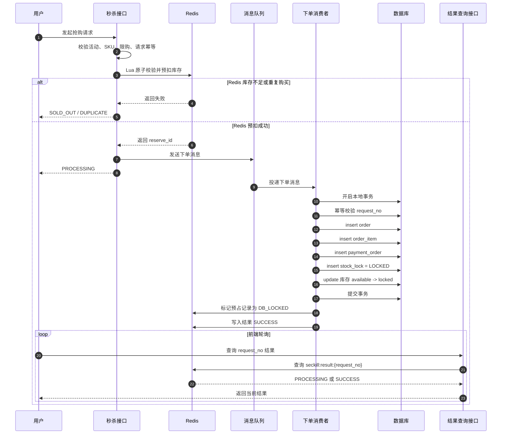

# 电商库存与活动名额设计详解

## 1. 核心结论

电商库存和活动名额的核心问题不是简单地“减一个数字”，而是要处理：

```text
高并发下不能超卖
用户下单后可能不支付
支付成功后才算真实成交
订单超时或取消后要释放库存
Redis 预扣和数据库最终事实要保持一致
活动进行中库存调整不能覆盖已扣减结果
```

推荐模型是：

```text
下单：可售 -> 锁定
支付成功：锁定 -> 已售/已使用
订单取消或超时：锁定 -> 可售
```

对应库存字段：

```text
available_stock  可售库存
locked_stock     锁定库存
sold_stock       已售库存
```

对应活动名额字段：

```text
available_quota  可用名额
locked_quota     锁定名额
used_quota       已使用名额
```

`locked_stock` 和 `locked_quota` 是中间状态，表示用户已经下单占住了资源，但还没有支付成功。

---

## 2. 库存字段一般挂在哪里

库存汇总字段一般挂在 SKU 库存表上，而不是直接挂在 SPU 商品表上。

原因是库存通常是 SKU 维度的。

例如：

```text
SPU：iPhone 手机壳

SKU1：黑色 / iPhone 15，库存 100
SKU2：白色 / iPhone 15，库存 50
SKU3：黑色 / iPhone 16，库存 80
```

真实下单扣减的是某一个具体 SKU。

推荐库存表：

```text
sku_stock
- id
- sku_id
- total_stock        总库存
- available_stock    可售库存
- locked_stock       锁定库存
- sold_stock         已售库存
- version            乐观锁版本号
- created_at
- updated_at
```

如果是多商户系统，可以加：

```text
merchant_id
```

如果是多仓库存，可以加：

```text
warehouse_id
```

如果商品区分普通库存和活动库存，普通库存和活动库存通常不要混在一张语义不清的表里，可以单独建活动库存或活动名额表。

---

## 3. 为什么需要锁定库存

用户下单和支付不是同一个动作。

典型电商流程是：

```text
用户提交订单
  -> 订单待支付
  -> 用户去微信/支付宝支付
  -> 支付成功回调
```

中间的待支付状态可能持续 5 分钟、15 分钟或 30 分钟。

如果下单时不锁库存，而是等支付成功后才扣库存，会有超卖风险。

### 3.1 不锁库存的问题

假设某个 SKU 只剩 1 件：

```text
available_stock = 1
```

如果下单时不占库存：

```text
用户 A 下单，待支付
用户 B 下单，待支付
用户 C 下单，待支付
```

三个用户都可能进入支付页面。

如果 A、B 都支付成功，系统才去扣库存，就会发现只有 1 件库存，但是已经有 2 个用户付款。

这时只能：

```text
给用户退款
人工处理
拆单补货
赔付
```

这些都比下单阶段锁库存更复杂。

### 3.2 直接更新已售库存的问题

有些人会问：为什么下单时不直接更新 `sold_stock`？

不推荐。

因为用户下单不代表真实卖出。

如果下单时直接：

```text
sold_stock = sold_stock + quantity
```

会带来几个问题：

```text
未支付订单会污染真实销量
订单取消后还要把 sold_stock 加回来，语义别扭
销售统计会被待支付订单放大
支付成功和取消补偿的幂等会更难处理
```

所以更清晰的语义是：

```text
待支付占用：locked_stock
真实成交：sold_stock
```

---

## 4. 库存三阶段流转

假设某个 SKU 初始库存 100：

```text
total_stock = 100
available_stock = 100
locked_stock = 0
sold_stock = 0
```

### 4.1 下单预占库存

用户下单买 2 件。

库存变化：

```text
available_stock = available_stock - 2
locked_stock = locked_stock + 2
```

结果：

```text
total_stock = 100
available_stock = 98
locked_stock = 2
sold_stock = 0
```

含义：

```text
这 2 件已经被订单占住了，其他用户不能再买。
但用户还没支付成功，所以还不能算已售。
```

### 4.2 支付成功确认库存

支付成功回调后：

```text
locked_stock = locked_stock - 2
sold_stock = sold_stock + 2
```

结果：

```text
total_stock = 100
available_stock = 98
locked_stock = 0
sold_stock = 2
```

含义：

```text
下单时锁定的 2 件正式成交。
```

注意：支付成功后不要再次扣 `available_stock`，因为下单时已经扣过可售库存。

### 4.3 订单超时或取消释放库存

如果用户没有支付，订单超时关闭：

```text
available_stock = available_stock + 2
locked_stock = locked_stock - 2
```

结果：

```text
total_stock = 100
available_stock = 100
locked_stock = 0
sold_stock = 0
```

含义：

```text
原来被订单占住的 2 件重新回到可售库存。
```

---

## 5. 锁定明细表

只在 `sku_stock` 里保存汇总字段还不够，实际项目中通常还需要一张库存锁定明细表。

推荐表：

```text
stock_lock
- lock_id
- order_id
- order_item_id
- user_id
- sku_id
- quantity
- status          LOCKED / CONFIRMED / RELEASED / EXPIRED
- expire_time
- created_at
- updated_at
```

核心字段：

| 字段 | 说明 |
| --- | --- |
| order_id | 这次库存锁定属于哪一笔订单 |
| order_item_id | 对应哪一条订单商品明细 |
| user_id | 哪个用户占用了库存，方便排查、风控、限购 |
| sku_id | 锁定哪个 SKU |
| quantity | 锁定数量 |
| status | 锁定状态 |
| expire_time | 锁定过期时间 |

其中 `order_id` 非常关键。

支付成功、订单取消、订单超时释放库存时，系统都需要根据订单找到对应的库存锁定记录。

`user_id` 强烈建议存。

虽然可以通过 `order_id` 反查用户，但冗余 `user_id` 有几个好处：

```text
方便查询某个用户占用了哪些库存
方便做用户维度风控
方便做限购判断
减少排查问题时的 join
```

### 5.1 锁定明细的作用

锁定明细解决的是“这笔订单到底锁了什么”的问题。

比如订单 `O1001` 买了两个 SKU：

```text
SKU001，锁定 1 件
SKU002，锁定 2 件
```

对应锁定明细：

```text
stock_lock L001
- order_id = O1001
- sku_id = SKU001
- quantity = 1
- status = LOCKED

stock_lock L002
- order_id = O1001
- sku_id = SKU002
- quantity = 2
- status = LOCKED
```

支付成功时，只处理 `status = LOCKED` 的记录：

```text
LOCKED -> CONFIRMED
```

订单取消时，只处理 `status = LOCKED` 的记录：

```text
LOCKED -> RELEASED
```

这样可以保证幂等，避免重复支付回调或重复取消消息导致库存重复确认或重复释放。

---

## 6. 典型 SQL

### 6.1 下单锁库存

```sql
update sku_stock
set available_stock = available_stock - #{quantity},
    locked_stock = locked_stock + #{quantity}
where sku_id = #{skuId}
  and available_stock >= #{quantity};
```

如果更新行数为 1，说明锁库存成功。

如果更新行数为 0，说明库存不足。

然后插入锁定明细：

```sql
insert into stock_lock (
    lock_id,
    order_id,
    order_item_id,
    user_id,
    sku_id,
    quantity,
    status,
    expire_time
) values (
    #{lockId},
    #{orderId},
    #{orderItemId},
    #{userId},
    #{skuId},
    #{quantity},
    'LOCKED',
    #{expireTime}
);
```

### 6.2 支付成功确认库存

先把锁定明细从 `LOCKED` 改为 `CONFIRMED`：

```sql
update stock_lock
set status = 'CONFIRMED',
    updated_at = now()
where order_id = #{orderId}
  and sku_id = #{skuId}
  and status = 'LOCKED';
```

如果更新成功，再更新库存汇总：

```sql
update sku_stock
set locked_stock = locked_stock - #{quantity},
    sold_stock = sold_stock + #{quantity}
where sku_id = #{skuId}
  and locked_stock >= #{quantity};
```

实际项目中，这两步应该在同一个本地事务里。

### 6.3 订单取消释放库存

先把锁定明细从 `LOCKED` 改为 `RELEASED` 或 `EXPIRED`：

```sql
update stock_lock
set status = 'RELEASED',
    updated_at = now()
where order_id = #{orderId}
  and sku_id = #{skuId}
  and status = 'LOCKED';
```

如果更新成功，再更新库存汇总：

```sql
update sku_stock
set available_stock = available_stock + #{quantity},
    locked_stock = locked_stock - #{quantity}
where sku_id = #{skuId}
  and locked_stock >= #{quantity};
```

这样重复释放时，第二次会因为 `stock_lock.status` 已经不是 `LOCKED` 而不再执行库存回补。

---

## 7. version 字段的意义

库存表里经常会有：

```text
version
```

它通常用于乐观锁。

库存是高并发热点数据，多个请求可能同时修改同一条 SKU 库存。

乐观锁更新方式：

```sql
update sku_stock
set available_stock = available_stock - 1,
    locked_stock = locked_stock + 1,
    version = version + 1
where sku_id = #{skuId}
  and available_stock >= 1
  and version = #{oldVersion};
```

如果更新行数为 0，说明这条库存记录已经被其他请求修改过，需要重新查询、重试或返回库存不足。

不过对于简单扣库存，下面这种原子条件更新已经可以防超卖：

```sql
update sku_stock
set available_stock = available_stock - #{quantity},
    locked_stock = locked_stock + #{quantity}
where sku_id = #{skuId}
  and available_stock >= #{quantity};
```

所以 `version` 不是所有场景都必须，但它对复杂库存修改很有价值，例如：

```text
后台调整库存
多字段一起变更
ORM 框架统一乐观锁
防止旧数据覆盖新数据
```

---

## 8. 活动名额设计

活动名额和库存非常类似。

例如一个秒杀活动只放出 100 个名额，或者某个权益活动只有 50 个预约名额。

推荐表：

```text
activity_quota
- id
- activity_id
- sku_id              可选，如果活动按 SKU 控制名额
- total_quota         总名额
- available_quota     可用名额
- locked_quota        锁定名额
- used_quota          已使用名额
- per_user_limit      单用户限制
- start_time
- end_time
- version
- created_at
- updated_at
```

活动名额流转：

```text
下单或预约：
available_quota -> locked_quota

支付成功或核销成功：
locked_quota -> used_quota

订单取消、预约取消或超时：
locked_quota -> available_quota
```

示例：

```text
total_quota = 50
available_quota = 50
locked_quota = 0
used_quota = 0
```

用户下单占 1 个名额：

```text
available_quota = 49
locked_quota = 1
used_quota = 0
```

支付成功：

```text
available_quota = 49
locked_quota = 0
used_quota = 1
```

订单超时：

```text
available_quota = 50
locked_quota = 0
used_quota = 0
```

活动名额也建议有锁定明细：

```text
activity_quota_lock
- lock_id
- activity_id
- order_id
- order_item_id
- user_id
- sku_id
- quantity
- status          LOCKED / CONFIRMED / RELEASED / EXPIRED
- expire_time
- created_at
- updated_at
```

---

## 9. Redis 预扣库存

普通电商下单可以直接用数据库条件更新扣库存。

但秒杀、抢购、限量预约这类高并发场景，如果所有请求都打到数据库同一行，会产生严重热点行竞争。

例如 10 万人抢 100 件商品：

```text
数据库同一条 sku_stock 被 10 万个请求竞争更新
行锁等待严重
连接池可能被打满
订单服务和支付服务也会被大量无效请求拖垮
```

所以高并发场景常用 Redis 做入口预扣。

Redis 的作用是：

```text
快速判断是否还有库存
快速拦截无库存请求
把高并发热点从数据库转移到 Redis 原子操作
保护后面的订单链路
```

### 9.1 Redis 扣的是什么

Redis 中一般缓存的是可售库存或可用名额。

例如：

```text
seckill:stock:activity:1001:sku:SKU001 = 100
```

或者：

```text
activity:quota:1001 = 50
```

Redis 扣减的是：

```text
available_stock
available_quota
```

不是 `sold_stock`，也不是 `locked_stock`。

### 9.2 不要直接无脑 DECR

Redis 的 `DECR` 是原子的，但它可能把库存扣成负数。

例如：

```text
stock = 0
DECR 后变成 -1
```

所以更推荐 Lua 脚本，把“判断库存是否足够”和“扣减库存”放在一个原子操作里。

示例逻辑：

```lua
local stock = tonumber(redis.call('GET', KEYS[1]) or '0')
local quantity = tonumber(ARGV[1])

if stock < quantity then
    return 0
end

redis.call('DECRBY', KEYS[1], quantity)
return 1
```

返回值：

```text
1：预扣成功
0：库存不足
```

---

## 10. Redis 扣减后如何同步数据库

Redis 只是高并发入口的预扣层，数据库仍然是最终事实。

推荐流程：

```text
1. Redis Lua 原子预扣 available_stock / available_quota
2. Redis 扣成功后，开启数据库事务
3. 创建 order、order_item、payment_order
4. 创建 stock_lock / activity_quota_lock，状态 LOCKED
5. 更新数据库 sku_stock 或 activity_quota：available -> locked
6. 提交事务
```

下单成功后，Redis 和数据库含义保持一致：

```text
Redis 可售库存减少
DB available_stock 减少
DB locked_stock 增加
stock_lock 记录这笔订单锁了哪些库存
```

支付成功后：

```text
DB stock_lock: LOCKED -> CONFIRMED
DB sku_stock: locked_stock -> sold_stock
Redis 不再扣库存，因为下单时已经扣过
```

订单超时或取消后：

```text
DB stock_lock: LOCKED -> RELEASED / EXPIRED
DB sku_stock: locked_stock -> available_stock
Redis INCRBY 回补可售库存
```

---

## 11. Redis 和数据库的一致性问题

Redis 预扣会引入一致性问题。

最大风险是：

```text
Redis 扣成功
数据库订单创建失败
```

此时 Redis 库存少了，但数据库没有订单、没有锁定明细。

### 11.1 立即回补

如果 Redis 扣成功后，数据库事务失败，应该立即回补 Redis：

```text
INCRBY stock_key quantity
```

但这不是完整方案。

因为服务可能在 Redis 扣成功后直接宕机，根本没机会回补。

### 11.2 Redis 预占记录

更稳的做法是 Redis 扣库存时，同时写一条预占记录。

可以通过 Lua 原子完成：

```text
判断库存是否足够
扣减 Redis 可售库存
写 Redis 预占记录
```

预占记录示例：

```text
stock:reserve:O1001
- order_id = O1001
- user_id = U001
- sku_id = SKU001
- quantity = 1
- status = PRE_DEDUCTED
- expire_time = 30 分钟后
```

数据库事务成功后，把预占记录标记为：

```text
DB_LOCKED
```

表示 Redis 预扣已经被数据库 `stock_lock` 承接。

### 11.3 补偿任务

补偿任务定期扫描 Redis 预占记录。

如果发现：

```text
status = PRE_DEDUCTED
并且已经超过几秒或几十秒
```

就查询数据库：

```text
是否存在 order
是否存在 stock_lock
```

如果数据库没有锁定明细：

```text
说明 Redis 扣了，但 DB 没成功
需要 INCRBY 回补 Redis 库存
并把预占记录标记为 RELEASED
```

如果数据库有 `stock_lock = LOCKED`：

```text
说明 DB 已经成功
把 Redis 预占记录标记为 DB_LOCKED
```

核心原则：

```text
Redis 负责入口预扣
数据库负责最终事实
预占记录和补偿任务负责兜底一致性
```

### 11.4 Redis 预扣成功后的 MQ 下单与前端轮询

在秒杀或爆品场景中，推荐的链路是：

```text
Redis Lua 预扣库存
  -> 发送 MQ 下单消息
  -> MQ 消费者异步创建订单
  -> 数据库写入锁定明细
  -> 前端轮询下单结果
```

这样可以避免大量请求直接竞争数据库中的同一条库存记录。

#### 11.4.1 请求入口

用户请求进入后，先做不涉及库存修改的快速校验：

```text
用户是否登录
活动是否开始
活动是否结束
SKU 是否属于活动
用户是否超过限购数量
请求是否重复
```

校验通过后，调用 Redis Lua 脚本：

```text
1. 判断 Redis 可售库存是否足够
2. 判断用户是否已经抢购
3. 扣减 Redis 可售库存
4. 写入 Redis 预占记录
5. 返回 request_no / reserve_id
```

预扣成功后，不建议同步执行完整下单事务，而是发送 MQ 消息：

```text
order_create_message
- request_no
- reserve_id
- user_id
- activity_id
- sku_id
- quantity
```

前端可以先拿到：

```text
PROCESSING
```

表示请求已经进入排队，不代表订单已经创建成功。

#### 11.4.2 MQ 消费创建订单

消费者从 MQ 取到消息后，开启数据库事务：

```text
1. 根据 request_no 做幂等判断
2. 创建 order
3. 创建 order_item
4. 创建 payment_order
5. 创建 stock_lock，状态为 LOCKED
6. 更新 sku_stock 或 activity_quota
   available -> locked
7. 将 Redis 预占记录标记为 DB_LOCKED
8. 提交事务
```

数据库更新仍然建议使用条件更新兜底：

```sql
update activity_quota
set available_quota = available_quota - #{quantity},
    locked_quota = locked_quota + #{quantity}
where activity_id = #{activityId}
  and sku_id = #{skuId}
  and available_quota >= #{quantity};
```

Redis 已经提前筛掉了绝大多数无库存请求，因此真正进入数据库的请求数量接近实际库存量，数据库乐观锁或条件更新的冲突会显著减少。

但这不代表数据库层可以完全取消校验。Redis 可能因为异常、延迟或数据不一致而返回成功，数据库必须保留最终兜底。

#### 11.4.3 前端轮询结果

系统可以把抢购结果保存到 Redis 或结果表：

```text
seckill:result:{request_no}
```

结果状态可以包括：

```text
PROCESSING  排队处理中
SUCCESS     下单成功
FAILED      下单失败
SOLD_OUT    库存不足
DUPLICATE   重复请求或重复购买
EXPIRED     预占已过期
```

前端轮询：

```text
第一次：PROCESSING
第二次：PROCESSING
第三次：SUCCESS，返回 order_id/pay_order_id
```

下单成功后，前端再跳转支付页面。

#### 11.4.4 时序图



#### 11.4.5 异常处理

| 异常场景 | 处理方式 |
| --- | --- |
| Redis 预扣失败 | 直接返回库存不足或重复购买 |
| Redis 预扣成功，MQ 发送失败 | 重试投递，最终失败则回补 Redis |
| MQ 重复投递 | 根据 `request_no` 做幂等 |
| MQ 消费时 DB 失败 | MQ 重试，超过次数进入死信队列 |
| DB 最终创建失败 | 回补 Redis，预占记录标记 RELEASED |
| DB 成功但响应丢失 | 前端继续轮询，重复消费也不能重复创建订单 |
| 订单创建成功但用户未支付 | 超时关闭订单并释放库存 |

所以这套方案不是“Redis 成功就一定下单成功”，而是：

```text
Redis 成功：代表获得了进入下单队列的资格
MQ 消费成功：代表订单落库成功
支付成功：代表库存锁定正式转为已售
```

---

## 12. Redis 库存怎么初始化

秒杀、抢购、限量活动不建议等第一个用户请求来了再查库写 Redis。

更推荐活动开始前预热库存。

### 12.1 活动预热

例如活动 10:00 开始，系统可以在 9:55 预热：

```text
1. 查询活动商品和活动库存
2. 校验活动状态、活动时间、商品状态
3. 把活动库存写入 Redis
4. 设置 Redis key 过期时间
5. 标记活动已预热
```

Redis key 示例：

```text
seckill:stock:activity:1001:sku:SKU001 = 100
```

活动库存来自数据库活动库存表：

```text
activity_sku_stock
- activity_id = 1001
- sku_id = SKU001
- total_quota = 100
- available_quota = 100
- locked_quota = 0
- used_quota = 0
```

预热：

```redis
SET seckill:stock:activity:1001:sku:SKU001 100 EX 7200
```

### 12.2 为什么不建议首次请求懒加载

如果第一个请求发现 Redis 没有库存 key，于是查数据库再写 Redis，会有风险。

活动开始瞬间可能出现：

```text
大量请求同时发现 Redis 没 key
多个请求同时查数据库
多个请求同时 SET Redis 库存
某个请求已经扣减 Redis，另一个请求又 SET 回原始库存
```

这会导致库存覆盖，严重时造成超卖。

所以秒杀库存初始化最好由：

```text
活动发布流程
活动预热任务
活动状态切换任务
```

统一完成。

### 12.3 预热要防止重复覆盖

活动开始后不能随便：

```redis
SET stock_key 100
```

因为 Redis 当前库存已经可能被扣减。

推荐：

```text
活动开始前允许初始化
活动开始后禁止覆盖库存 key
```

可以使用：

```redis
SETNX stock_key 100
```

或者通过活动状态控制：

```text
DRAFT -> SCHEDULED -> PREHEATED -> RUNNING -> ENDED
```

只有 `SCHEDULED -> PREHEATED` 时允许初始化 Redis 库存。

---

## 13. 活动进行中修改库存

活动进行中，库存不能直接覆盖 Redis。

也就是说，不应该这样：

```redis
SET seckill:stock:activity:1001:sku:SKU001 120
```

因为 Redis 当前库存已经反映了活动进行中的扣减。

正确做法是按 `delta` 增减。

### 13.1 什么是 delta

`delta` 是变化量：

```text
delta = 新总库存 - 原总库存
```

例如活动初始库存 100，活动进行中 Redis 当前可售库存已经扣到 60。

运营把活动总库存从 100 调整到 120。

变化量：

```text
delta = 120 - 100 = +20
```

Redis 应该：

```redis
INCRBY seckill:stock:activity:1001:sku:SKU001 20
```

Redis 结果：

```text
60 + 20 = 80
```

不能直接：

```redis
SET stock_key 120
```

否则会把已经被用户抢走、锁定、支付的库存重新加回来。

### 13.2 增加活动库存

增加库存相对安全。

流程：

```text
1. 后台提交活动库存 +20
2. DB 事务更新 activity_sku_stock
   total_quota = total_quota + 20
   available_quota = available_quota + 20
3. 写库存调整记录 stock_adjust_log
4. Redis INCRBY stock_key 20
5. 标记调整记录已同步
```

调整日志：

```text
stock_adjust_log
- adjust_id
- activity_id
- sku_id
- delta
- type: ADD / REDUCE
- status: PENDING / SYNCED / FAILED
- operator
- created_at
```

如果 Redis 同步失败，可以根据调整日志重试。

### 13.3 减少活动库存

减少库存更危险。

只能减少还没有被锁定、还没有被使用的可用库存：

```text
减少数量 <= 当前 available_quota
```

不能影响：

```text
locked_quota
used_quota
```

例如当前：

```text
total_quota = 100
available_quota = 10
locked_quota = 20
used_quota = 70
```

如果运营想把总库存从 100 改成 80：

```text
当前 locked + used = 90
```

这时不允许。

因为已经有 90 个名额被锁定或使用，不能把总库存改成 80。

如果只是从 100 改成 95：

```text
delta = 95 - 100 = -5
```

可以减少 5 个可用名额：

```text
total_quota = 95
available_quota = 5
locked_quota = 20
used_quota = 70
```

Redis：

```redis
DECRBY stock_key 5
```

更严谨地说，Redis 减库存也应该用 Lua 判断，不能扣成负数。

### 13.4 活动中可修改字段和不可修改字段

活动进行中，比较安全的字段：

```text
活动标题
活动图片
活动描述
展示排序
页面文案
客服说明
部分展示标签
```

这些字段修改后，可以：

```text
更新 DB
删除 Redis 缓存
或发送 ActivityUpdated 消息刷新缓存
```

活动进行中不建议随便改：

```text
活动商品
活动价格
活动库存减少
用户限购规则
开始时间
库存扣减规则
退款规则
优惠计算规则
```

更稳妥的产品规则是：

```text
活动进行中允许追加库存
活动进行中不允许减少库存或修改核心交易规则
必须修改时，先暂停活动，再做受控调整
```

---

## 14. 完整案例

假设活动 `A1001` 的 SKU `SKU001` 放出 100 件秒杀库存。

### 14.1 活动预热

数据库：

```text
activity_sku_stock
- activity_id = A1001
- sku_id = SKU001
- total_quota = 100
- available_quota = 100
- locked_quota = 0
- used_quota = 0
```

Redis：

```text
seckill:stock:A1001:SKU001 = 100
```

### 14.2 用户下单

用户 `U001` 抢购 1 件。

Redis Lua 扣减：

```text
seckill:stock:A1001:SKU001 = 99
```

数据库事务：

```text
insert order O1001，状态 WAIT_PAY
insert order_item I1001
insert payment_order P1001
insert activity_quota_lock L1001，状态 LOCKED

activity_sku_stock:
available_quota = 99
locked_quota = 1
used_quota = 0
```

### 14.3 支付成功

支付成功回调后：

```text
activity_quota_lock L1001:
LOCKED -> CONFIRMED

activity_sku_stock:
available_quota = 99
locked_quota = 0
used_quota = 1
```

Redis 不需要再扣。

### 14.4 订单超时

如果用户没有支付，订单超时：

```text
activity_quota_lock L1001:
LOCKED -> EXPIRED

activity_sku_stock:
available_quota = 100
locked_quota = 0
used_quota = 0

Redis:
INCRBY seckill:stock:A1001:SKU001 1
```

### 14.5 活动中追加库存

活动进行一段时间后：

```text
Redis 当前库存 = 60
DB total_quota = 100
```

运营把活动库存调成 120。

计算：

```text
delta = 120 - 100 = +20
```

数据库：

```text
total_quota = 120
available_quota = available_quota + 20
```

Redis：

```text
INCRBY seckill:stock:A1001:SKU001 20
```

结果：

```text
Redis 当前库存 = 80
```

不是 120。

---

## 15. 常见误区

### 15.1 误区一：下单时直接加 sold_stock

不建议。

下单只是占用库存，不代表真实成交。

正确做法：

```text
下单：available -> locked
支付成功：locked -> sold
```

### 15.2 误区二：支付成功后再第一次扣库存

不建议。

支付成功后才扣库存容易导致超卖，因为多个用户可能同时拿着待支付订单去付款。

正确做法：

```text
下单前完成库存预占
支付成功后确认库存消耗
```

### 15.3 误区三：Redis 直接 SET 活动库存

活动进行中不应该直接覆盖 Redis 库存。

正确做法：

```text
按 delta 增减
```

### 15.4 误区四：Redis 扣库存后不写数据库锁定明细

不建议。

Redis 只是入口预扣层，不是最终库存账本。

必须有：

```text
order
order_item
stock_lock / activity_quota_lock
sku_stock / activity_quota
```

### 15.5 误区五：只靠立即回补解决一致性

不够。

服务可能在 Redis 扣成功后宕机，没机会立即回补。

更稳的做法：

```text
Redis 预占记录
数据库锁定明细
补偿任务
定期对账
```

---

## 16. 总结

库存和活动名额的推荐设计：

```text
汇总表：
sku_stock / activity_quota

锁定明细：
stock_lock / activity_quota_lock

高并发预扣：
Redis available_stock / available_quota
```

库存流转：

```text
下单：
available_stock -> locked_stock

支付成功：
locked_stock -> sold_stock

取消或超时：
locked_stock -> available_stock
```

活动名额流转：

```text
预约或下单：
available_quota -> locked_quota

支付成功或核销：
locked_quota -> used_quota

取消或超时：
locked_quota -> available_quota
```

Redis 一致性原则：

```text
Redis 负责高并发入口预扣。
Redis 预扣成功后，通过 MQ 异步创建订单。
前端轮询 request_no 对应的处理结果。
数据库负责最终事实。
锁定明细负责记录订单占用。
补偿任务负责处理 Redis 扣成功但 DB 失败。
活动中库存调整按 delta 增减，不能直接覆盖 Redis 当前库存。
```

最重要的一句话：

**锁定库存/锁定名额是为了表达“用户已经占住资源，但还没完成最终成交”的中间状态。没有这个中间状态，超卖、取消回补、支付幂等、库存统计都会变得更复杂。**
