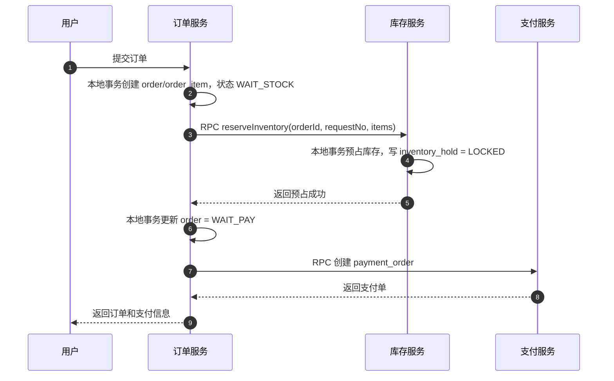
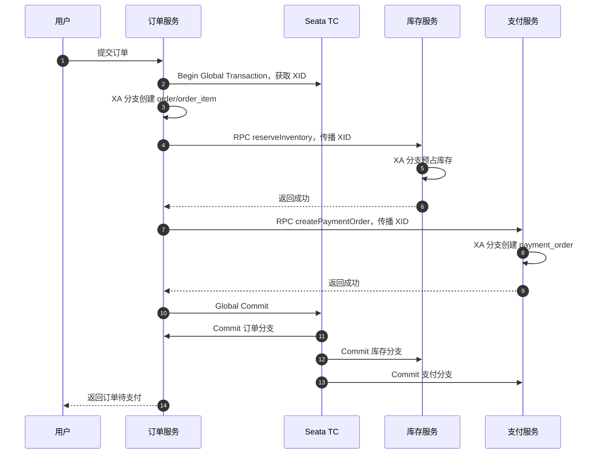

# 电商微服务事务与 Seata 模式详解

## 1. 核心结论

在电商微服务架构中，订单、购物车、库存、支付通常拆成不同服务：

```text
购物车服务
订单服务
库存服务
支付服务
营销服务
商品服务
```

这些服务即使都注册在同一个注册中心，也不代表它们可以共享一个本地事务。

注册中心解决的是：

```text
服务在哪里
如何发现服务实例
如何做负载均衡
如何感知服务上下线
```

它不解决：

```text
跨服务事务
跨库一致性
消息持久化
失败重试
削峰
补偿
```

所以，微服务下单链路通常需要在以下方案中取舍：

```text
RPC 同步调用
MQ 异步事件
Seata 分布式事务
Saga 补偿
Redis 预扣 + MQ 削峰
```

核心判断：

```text
普通低冲突链路：可以用 RPC，也可以引入 Seata。
高并发秒杀链路：更推荐 Redis Lua 预扣 + MQ 削峰 + 幂等补偿。
支付回调和后续通知：更推荐 MQ 事件驱动。
```

---

## 2. 注册中心、RPC、MQ、Seata 分别解决什么

| 组件 | 解决的问题 | 不解决的问题 |
| --- | --- | --- |
| 注册中心 | 服务发现、实例注册、健康检查 | 分布式事务、消息持久化 |
| RPC | 同步远程调用、立即拿结果 | 削峰、跨服务事务自动一致 |
| MQ | 异步解耦、削峰、重试、死信 | 立即返回最终结果、强一致事务 |
| Seata | 分布式事务协调 | 高并发削峰、外部系统事务 |

所以不能简单认为：

```text
服务都在同一个注册中心，所以只用 RPC 就够了。
```

也不能简单认为：

```text
用了 MQ 就自动一致。
```

实际项目经常是组合使用：

```text
查询类：RPC
普通库存预占：RPC 或 Seata
秒杀下单：Redis + MQ
支付成功通知：MQ
库存释放：MQ 或 RPC + 幂等
```

---

## 3. 普通 RPC 下单链路

在普通电商下单中，订单服务可以通过 RPC 调库存服务。

示例流程：

```text
1. 用户提交订单
2. 订单服务创建 order，状态 WAIT_STOCK
3. 订单服务 RPC 调用库存服务 reserveInventory
4. 库存服务预占库存，写 inventory_hold
5. 库存服务返回成功
6. 订单服务更新 order = WAIT_PAY
7. 订单服务或支付服务创建 payment_order
```

时序图：



这种方案适合：

```text
普通商品
并发不极端
需要用户立即知道下单结果
服务链路较短
```

但 RPC 本身不能自动解决分布式一致性。

例如库存服务已经预占成功，但响应订单服务时网络超时：

```text
库存服务成功了
订单服务没收到成功响应
```

这时订单服务不能盲目重试，否则可能重复锁库存。

所以即使用 RPC，也必须设计：

```text
requestNo 幂等
库存预占状态查询
库存释放补偿
接口超时重试策略
```

---

## 4. 为什么很多场景仍然需要 MQ

MQ 的价值不是替代 RPC，而是解决 RPC 不擅长的问题。

### 4.1 削峰

秒杀开始瞬间，可能有大量请求同时进来。

如果全部同步 RPC：

```text
用户请求占住应用线程
订单服务等待库存服务响应
库存服务压力传导到订单服务
数据库热点行被高并发竞争
```

MQ 可以把瞬时流量削平：

```text
Redis Lua 预扣成功
  -> 投递 MQ
  -> 消费者按数据库承载能力慢慢创建订单
  -> 前端轮询结果
```

### 4.2 解耦支付后续动作

支付成功后，可能要做很多事：

```text
更新订单
确认库存
核销优惠券
增加积分
通知仓库
发送短信
```

如果支付服务同步 RPC 调所有下游：

```text
支付服务 -> 订单服务
支付服务 -> 库存服务
支付服务 -> 优惠券服务
支付服务 -> 积分服务
支付服务 -> 通知服务
```

任何一个服务慢或失败，都会拖慢支付回调链路。

更推荐：

```text
支付服务本地事务更新 payment_flow/payment_order
写 outbox: PaymentSucceeded
异步发布 MQ
订单、库存、营销、积分分别消费
```

### 4.3 重试和死信

MQ 可以提供：

```text
失败重试
延迟消息
死信队列
消费位点
异步补偿
```

这些能力对于订单取消、超时释放库存、支付成功后续处理很重要。

---

## 5. Seata 可以和 RPC 一起使用吗

可以。

RPC 是通信方式，Seata 是分布式事务协调器。

只要 RPC 调用链可以传播 Seata 的全局事务上下文，也就是 `XID`，被调用服务就可以加入同一个全局事务。

例如：

```text
订单服务开启 Seata 全局事务
  -> RPC 调库存服务
  -> RPC 调支付服务
  -> 各服务加入同一个 XID
  -> Seata 统一提交或回滚
```

但要注意：

```text
Seata 解决的是分布式事务一致性。
Seata 不解决高并发削峰。
Seata 也不能把微信、支付宝这类外部系统纳入数据库事务。
```

---

## 6. Seata 的几种模式

Seata 常见模式包括：

```text
AT
TCC
Saga
XA
```

### 6.1 AT 模式

AT 模式是 Seata 最常见的模式之一。

特点：

```text
对业务代码侵入较低
依赖代理数据源
需要 undo_log
适合常规关系型数据库 CRUD
```

大致过程：

```text
1. 执行业务 SQL
2. Seata 记录 before image 和 after image 到 undo_log
3. 全局事务成功则提交
4. 全局事务失败则根据 undo_log 回滚数据
```

适合：

```text
普通订单创建
普通库存预占
营销券状态更新
常规数据库更新
```

不适合：

```text
超高并发热点库存
长事务
复杂非幂等外部调用
```

### 6.2 TCC 模式

TCC 是：

```text
Try
Confirm
Cancel
```

它把资源操作拆成三个显式阶段。

库存预占很适合用 TCC 思想建模：

```text
Try：预占库存 available -> locked
Confirm：确认库存 locked -> sold
Cancel：释放库存 locked -> available
```

优点：

```text
语义清晰
适合资源预留
业务可控
```

缺点：

```text
业务侵入高
每个参与者都要实现 Try/Confirm/Cancel
必须处理幂等、空回滚、悬挂问题
```

适合：

```text
库存冻结
账户余额冻结
活动名额预占
```

### 6.3 Saga 模式

Saga 适合长事务。

它的思路是：

```text
每个步骤先提交自己的本地事务
如果后续失败，就执行对应补偿动作
```

例如：

```text
创建订单成功
预占库存成功
创建支付单失败
  -> 补偿释放库存
  -> 补偿取消订单
```

优点：

```text
适合长流程
不长期锁资源
吞吐更好
```

缺点：

```text
不是严格强一致
补偿逻辑复杂
中间状态对业务可见
```

适合：

```text
订单履约
退款流程
跨多个业务系统的长链路
```

### 6.4 XA 模式

Seata 也支持 XA 模式。

XA 是数据库原生的分布式事务标准，Seata 在这里扮演事务协调器。

XA 的核心是两阶段提交：

```text
阶段一：prepare
阶段二：commit / rollback
```

流程：

```text
1. 订单服务开启全局事务
2. 订单服务本地 XA 分支执行 SQL
3. 库存服务本地 XA 分支执行 SQL
4. 所有分支 prepare 成功
5. Seata 通知所有分支 commit
6. 如果有任何分支失败，则统一 rollback
```

XA 的优点：

```text
强一致
基于数据库原生事务能力
业务侵入相对低
```

XA 的代价：

```text
资源锁持有时间更长
两阶段提交更重
吞吐较低
高并发热点场景容易放大锁等待
```

适合：

```text
纯数据库操作
短事务
并发可控
对强一致要求高
```

不适合：

```text
秒杀
爆品抢购
热点库存
长链路
外部支付渠道
MQ 消费链路
Redis 预扣主链路
```

---

## 7. Seata XA 下单示例

如果使用 `RPC + Seata XA`，普通下单链路可以这样：

```text
订单服务开启全局事务
  -> 创建 order/order_item
  -> RPC 调库存服务预占库存
  -> RPC 调支付服务创建 payment_order
  -> 所有分支 prepare
  -> 全部成功后全局提交
```

时序图：



如果库存服务失败：

```text
订单服务通知 Seata 全局回滚
订单分支回滚
库存分支回滚
支付分支回滚
```

这个模型的一致性很强，但代价是事务更重。

---

## 8. 为什么 XA 不适合秒杀热点链路

秒杀场景的核心矛盾不是“事务不知道怎么提交”，而是：

```text
瞬时请求太多
同一个 SKU 是热点
数据库同一行竞争太激烈
需要先削峰和过滤无效请求
```

XA 无法解决这个问题。

如果 10 万人同时抢 100 件商品，使用 XA 仍然会导致：

```text
大量请求进入订单服务
大量 XA 分支事务创建
大量请求竞争库存数据库热点行
prepare/commit 阶段持有锁更久
数据库吞吐下降
```

而 Redis Lua + MQ 的思路是：

```text
Redis Lua 先裁决谁有资格进入下单队列
库存不足的请求直接挡在 Redis 层
MQ 把成功请求削峰
数据库只处理接近库存量的订单创建
```

所以秒杀主链路更推荐：

```text
Redis Lua 预扣库存
  -> MQ 异步下单
  -> 前端轮询结果
  -> 数据库落订单和库存锁定明细
  -> 支付成功后确认库存
```

Seata 可以用于普通业务链路，但不应该作为秒杀库存扣减的主方案。

---

## 9. 模式选型建议

| 场景 | 推荐方案 |
| --- | --- |
| 普通查询 | RPC |
| 普通下单，流量可控 | RPC + 幂等，或 Seata AT/XA |
| 普通库存预占 | DB 条件更新，或 TCC 思想 |
| 账户冻结、库存冻结 | TCC 更贴近业务语义 |
| 秒杀、爆品抢购 | Redis Lua + MQ + 幂等补偿 |
| 支付成功后通知订单/库存/积分 | MQ 事件驱动 |
| 订单超时关闭 | 延迟消息/MQ + 幂等释放 |
| 长流程履约、退款 | Saga / 事件驱动补偿 |
| 纯数据库短事务、强一致 | Seata XA 可考虑 |

---

## 10. 实战建议

### 10.1 不要让支付回调进入重事务

支付回调链路应该短。

推荐：

```text
支付服务本地事务：
更新 payment_flow/payment_order
写 PaymentSucceeded outbox

异步消息：
订单服务更新订单
库存服务确认库存
营销服务核销优惠
积分服务加积分
```

不推荐：

```text
支付回调里同步 RPC 调一堆服务
或者把外部支付回调和内部库存、积分全部放进一个 XA 全局事务
```

### 10.2 所有跨服务操作都要幂等

无论 RPC、MQ、Seata，都需要幂等。

常见幂等键：

```text
request_no
order_id
pay_order_id
payment_flow_id
inventory_hold_id
message_id
```

库存服务必须保证：

```text
同一 order_id 只能预占一次
同一 inventory_hold 只能确认一次
同一 inventory_hold 只能释放一次
```

### 10.3 用 Outbox 保证本地事务和消息一致

例如订单服务不能简单地：

```text
先更新订单
再发 MQ
```

如果更新订单后服务宕机，消息可能丢失。

推荐本地事务同时写：

```text
order
outbox_event
```

再由后台任务投递 MQ。

这样可以保证：

```text
本地状态变化成功，消息最终一定会被投递。
```

### 10.4 Seata 不是银弹

Seata 很适合解决一部分跨服务数据库一致性问题。

但它不适合承担所有电商交易问题：

```text
不能替代 MQ 削峰
不能把微信、支付宝纳入数据库事务
不能解决热点 SKU 高并发竞争
不能消除幂等和补偿设计
```

---

## 11. 总结

微服务电商交易链路中：

```text
注册中心解决服务发现。
RPC 解决同步调用。
MQ 解决异步解耦、削峰、重试。
Seata 解决部分跨服务数据库事务一致性。
Redis 解决热点库存入口预扣和快速裁决。
```

Seata 模式选择：

```text
AT：适合常规数据库 CRUD，侵入低。
TCC：适合库存、账户这类资源预留，侵入高但语义清晰。
Saga：适合长流程和补偿型业务。
XA：适合纯数据库、短事务、强一致、并发可控的场景。
```

最终建议：

```text
普通订单：RPC + 幂等，必要时引入 Seata AT/XA。
库存预留：优先用 TCC 思想建模 available -> locked -> sold。
秒杀爆品：Redis Lua + MQ + 前端轮询 + 补偿对账。
支付回调：本地事务 + Outbox + MQ 事件驱动。
```

最重要的一句话：

**Seata XA 确实可以用于微服务分布式事务，但它适合强一致、短事务、并发可控的纯数据库场景；对于秒杀、爆品和热点库存，主问题是高并发削峰和热点竞争，应该优先使用 Redis 预扣、MQ 削峰、幂等和补偿机制。**
